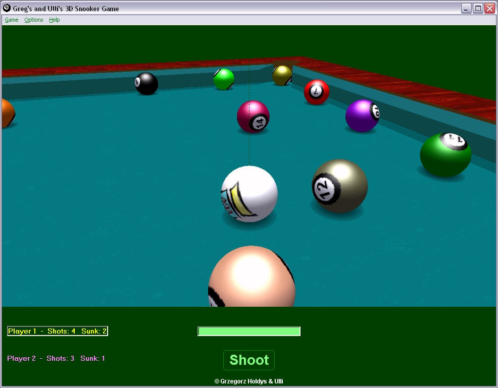



## Greg's 3D Pool Billard \(Version 2\.6\.50\)

### Description

This is a new version of Greg's 3D Pool (or whatever you may call it) with a few minor qirks removed and generally overhauled and extended; see various .txt files for further info; also see PSC CodeId 37583. Download is 388 kB.
 
### More Info
 
Needs DirectX 8 for VB Type Library.

             |
---                |---
**Submitted On**   |2008-01-21 12:48:06
**By**             |[ULLI](https://github.com/Planet-Source-Code/PSCIndex/blob/master/ByAuthor/ulli.md)
**Level**          |Advanced
**User Rating**    |5.0 (50 globes from 10 users)
**Compatibility**  |VB 6\.0
**Category**       |[Games](https://github.com/Planet-Source-Code/PSCIndex/blob/master/ByCategory/games__1-38.md)
**World**          |[Visual Basic](https://github.com/Planet-Source-Code/PSCIndex/blob/master/ByWorld/visual-basic.md)
**Archive File**   |[Greg's\_3D\_2099701292008\.zip](https://github.com/Planet-Source-Code/ulli-greg-s-3d-pool-billard-version-2-6-50__1-69960/archive/master.zip)

